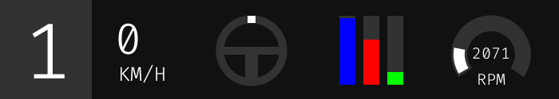

<p align="center">
    
</p>

# Telemetry Dashboard for DiRT Rally 2.0 (WIP)

## Displays

- Current gear
- Current speed
- Steering wheel position
- Throttle, brake and clutch pedals input
- Engine RPM

## Download and Installation
### Latest version is: **[v0.1.0-alpha](https://github.com/gabrielgouv/dirt-rally-telemetry-dashboard/releases/tag/v0.1.0-alpha)**

To download other versions, go to the [releases page](https://github.com/gabrielgouv/dirt-rally-telemetry-dashboard/releases) and look for the specific version.

This application does not have an installer, just run the executable file.

## DiRT Rally 2.0 configuration

1. Go to `C:\Users\<USER>\Documents\My Games\DiRT Rally 2.0\hardwaresettings`;
2. Open `hardware_settings_config` file with your favorite text editor;
3. Find for **udp** tag and configure as shown below:
      ```xml
      <motion_platform>
           ...
           <udp enabled="true" extradata="3" ip="127.0.0.1" port="10001" delay="1" />
           ...
       </motion_platform>
      ```
   - enabled = true
   - extradata = 3
   - port = 10001

4. Open your game and go to the **Options & Extras** menu;
5. Go to **Graphics** > **Basic Graphics** and set **Display Mode** to **Windowed Fullscreen**
-------------------------------------------------
> ⚠️ **The dashboard is not injected into the game, but a program configured to always stay on top. Because of this, it is not possible to play the game in Fullscreen option. To solve this problem we need to use the Windowed Fullscreen option.**
-------------------------------------------------
## Dashboard configuration
When downloading dashboard, it comes with a configuration file called **settings.cfg**. It is possible configure some settings and customize some dashboard colors.

You can check out an example template [here](/docs/examples/settings.cfg).

Before starting, check that the `port` defined in the settings file is the same as the one configured in DiRT Rally hardware settings. Also check that the `steering_wheel_max_degree_rotation` property matches your steering wheel and game configuration.

If there is any misconfiguration, the application will ignore the settings file and start with internal default values.
